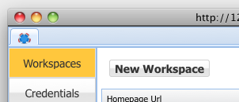
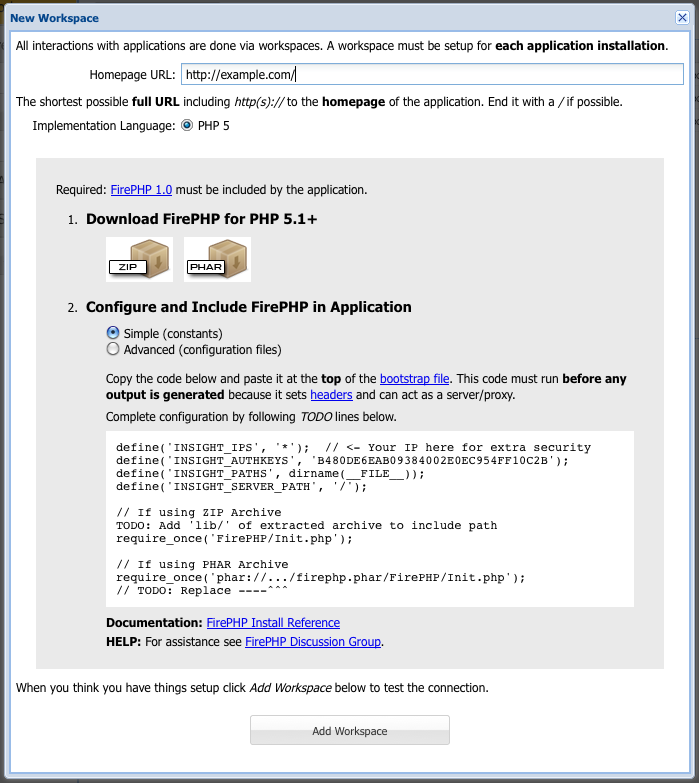

Authorizing is the process of pairing a client to a *FirePHP* (or more specifically [Insight](Insight)) installation. It involves
the client issuing an *Authorization Key* for a given [Installation URL](Insight#installation-url) and configuring this 
*Authorization Key* on the server.

This process ensures that only authorized clients are able to access application internal data.

Using [DeveloperCompanion](Clients#devcomp)
===========================================

[DeveloperCompanion](Clients#devcomp) facilitates the *FirePHP* setup process by generating the necessary *FirePHP*
[configuration](Install#configure) code based on the *Homepage URL* (read *Installation URL*) of an application.

REQUIRE: It is assumed you have [DeveloperCompanion](Clients#devcomp) installed.

  1. Launch *DeveloperCompanion* by clicking on it's icon in the Firefox status bar.
  
     {: resize="false"}

  2. Select the **first tab** which is the *home* or *companion* tab, click on **Workspaces** in the menu on the left and
     click on **New Workspace**.

     {: resize="false"}
  
  3. In the *New Workspace* window enter the URL to the **Homepage** of the application.

    
  
  4. Select the [Simple (constants)](Configuration/Constants) or [Advanced (configuration files)](Configuration/Files) 
     based configuration approach.
  
  5. Insert the generated code into the application. See [Install](Install#configure) for more information.
  
  6. Click **Add Workspace** at the bottom of the window. If everything is setup correctly the new workspace
     will be added and launched. If anything goes wrong, detailed error messages will be displayed.
 
Everything is now setup for the given installation and messages can now be logged to the client. See [API](API/Overview).
