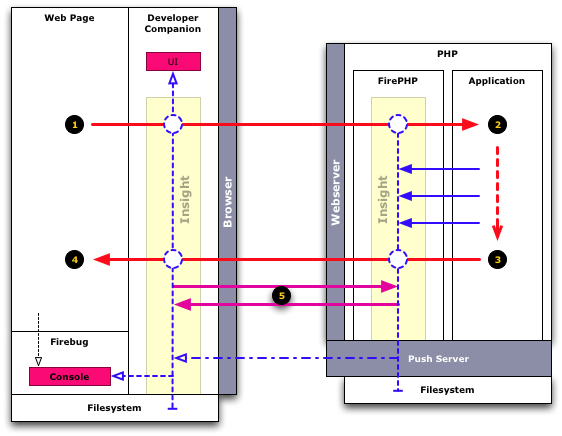

Overview
========

It is important to have a rough idea of how *FirePHP 1.0* works to leverage all features *FirePHP* has to offer.

NOTE: The discussion below assumes *FirePHP* is included via the configuration-based approaches (via the `FirePHP/*` files). See [Install](Install).

The most important aspect to realize is that *FirePHP* sits **between** the browser page and the PHP application on the server.
More specifically:

  * **On the server:** The [FirePHP Server Library](Install) is **included as the first code to run for EVERY request** to the application.
    The *FirePHP* library *wraps*
    the request allowing the application to use the [Insight API](API/Insight) to record internal data while executing. When the application
    has finished executing *FirePHP* injects some data into the *HTTP response headers* to identify the specific request.
  * **On the client:** The *FirePHP* compatible client parses the *HTTP response headers* and makes a **secondary request** to the `/<ServerScript.php>`
    on the server which *FirePHP* intercepts and responds to. Once all data arrives at the client it is directed to the appropriate targets.

Any client is *FirePHP* compatible if it implements the [Insight Intelligence System](Insight).

Request Flow
============

NOTE: **The *Push Server* is not yet implemented.**

{: resize="false" align="center"}

  1. The browser issues a request.
    * The *Insight* system on the client creates a context for the request and injects an identifier into the *HTTP request headers*.
    * The request is intercepted by *Insight* system on the server which creates a corresponding context for the request.
  2. The application responds to the request.
    * The *Application* uses the [Insight API](API/Insight) to record internal data while executing.
    * The *Insight* system on the server pushes recorded data to the client via the *Push Server* if available. (**Not yet implemented**)
  3. The response goes back to the client.
    * The *Insight* system on the server finalizes the request and writes a *pointer message* to the *HTTP response headers*. The pointer message
      includes a full URL to `/<ServerScript.php>`.
    * The *Insight* system on the client parses the *pointer message* to get the URL needed to fetch the internal data with a second request.
  4. The browser displays the application response.
  5. The internal request data is fetched (if the *Push Server* was not used).
    * The *Insight* system on the client makes a *secondary request* to fetch the internal request data from the server.
    * The *Insight* system on the server (responding via `/<ServerScript.php>`) returns the internal request data and **stops executing**
      meaning `/<ServerScript.php>` can point to *any* URL (that includes *FirePHP*) of the application.
    * The *Insight* system on the client parses the returned internal request data and directs it to the appropriate targets.

Targets
=======

There are two primary [targets](API/Insight#to) involved when recording internal data. The targets control how data is aggregated and where it is displayed.

  * **page** - The *page* target is intended to aggregate data in the context of the **Web Page** being displayed by the browser. Data logged
    to the *page-based console* (`FirePHP::to('page')->console()`) will be directed to the *Firebug Console* as *Firebug* is a tool that
    acts in the context of a *Web Page* comprising of one *page request* and multiple *resource requests*.

  * **request** - The *request* target is intended to aggregate data in the context of **One Request** only. This may be the *page request*
    or subsequent *resource* and *action requests*. Data logged to the *request-based console* (`FirePHP::to('request')->console()`) will be 
    loaded into the *DeveloperCompanion Request Inspector* when a *request* is [inspected](Workflow#inspecting-requests).

There are other targets and more will be added in future. See [Insight API](API/Insight#to).

Terminology
===========

TODO
