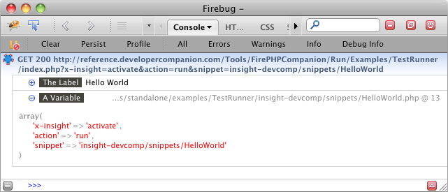
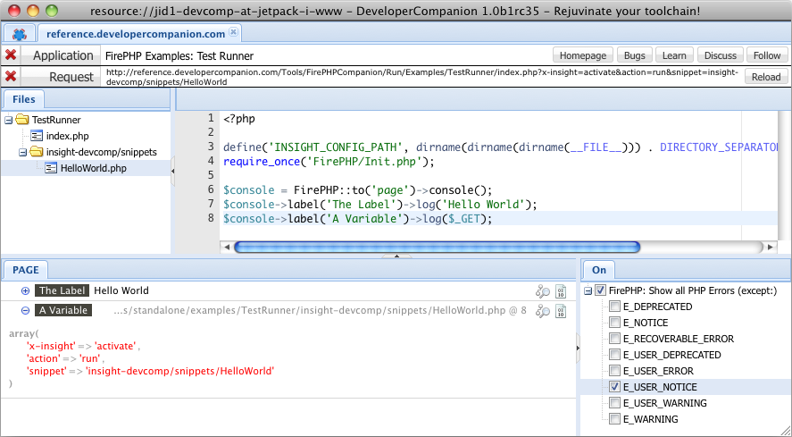

Welcome to the new official home of the FirePHP documentation.

NOTE: Some external links to FirePHP information are still included as not everything has been consolidated here yet.

Status
======

FirePHP 1.0 is currently in **public BETA** and will go STABLE very soon. Your [feedback](OpenSource#support) is important to get us there.

FirePHP 1.0
===========

Welcome to FirePHP 1.0, the result of 3+ years of learning and experimenting on how to build a PHP development and debugging solution that
can save you some real time and frustration.

**FirePHP is an advanced logging system that can display PHP variables in the browser as an application is navigated.** All communication
is out of band to the application meaning that the logging data will not interfere with the normal functioning of the application.

Traditionally, if you are not using an interactive debugger, you would typically debug your application with:

    CODE: {"lang":"php"}
    
    var_dump($variable);
    // or
    print_r($variable);

The problem with this approach is that:

  * The debug output is intermingled with your response data leading to broken page display and ajax responses
  * It is difficult to distinguish between many printed variables
  * It is impossible to determine where a specific debug message was triggered
  * The debug statements must be removed again when done
  * Larger object graphs (especially cyclical ones) cannot be printed or are too large too navigate intelligently

Previous attempts to solve these shortcomings have resulted in:

  * Interactive debuggers
  * PHP libraries that make printed variables more easy to navigate on the page
  * PHP libraries that log variables to files for later inspection

Each of these solutions have their place but overall the shortcomings make for a less than ideal day-to-day development
and debugging experience for the average developer in many/most cases.

The original goal of FirePHP (back in 2007) was to provide another approach by sending debug data in the response headers 
(no interference with response data) and display this nicely in the [Firebug](http://getfirebug.com/) [Console](http://getfirebug.com/commandline).
The approach seems to solve some real problems and is getting some good attention as FirePHP has become and continues to become more popular.

The FirePHP 1.0 system is the next incarnation of this approach and built from the groud up based on the
[latest research and technology](http://christophdorn.com/Research/) to provide the foundation for a new kind of
development and debugging approach that combines the best of:

  * **Error Reporting** - PHP native and used to detect syntax errors and API usage violations.
  * **Print Statements** - Deliberate *var_dump()* or *print()* statements by developer used to track execution flow and variables.
  * **Logging** - Deliberate logging to a file or other facility used to track events, execution flow and variables.
  * **Interactive Debugging** - PHP extension used by developer to directly interact with a running script to track live variable state.

PLANNED: FirePHP integration with [Xdebug](http://xdebug.org/) is planned.

With FirePHP 1.0, variables are logged using the [Insight API](API/Insight):

    CODE: {"lang":"php", "run": "http://reference.developercompanion.com/Tools/FirePHPCompanion/Run/Examples/TestRunner/index.php?x-insight=activate&action=run&snippet=insight-devcomp/snippets/HelloWorld"}

    $console = FirePHP::to('page')->console();
    $console->label('The Label')->log('Hello World');
    $console->label('A Variable')->log($_GET);

NOTE: The [traditional FirePHP API](API/FirePHP) is still supported.

And displayed in the [Firebug](http://getfirebug.com/) [Console](http://getfirebug.com/commandline) or the [DeveloperCompanion](Clients#devcomp) Request Inspector respectively:

 

FirePHP 1.0 is all about getting all types of meta and debug data from the server/application to the client in an intelligent way.
Now that variable logging is pretty much complete further development will be adding support for displaying server log files, PHP configuration information,
application source files and much more in the client.

We welcome your interest in FirePHP and hope that it will save you time and frustration.

Next Step: [Install](Install)
